# Divan

**Multi-perspective AI deliberation for hard decisions.**

Divan assembles a council of AI advisors with distinct worldviews, runs them in parallel on your question, then synthesizes everything into a decision brief. Named after the Ottoman *Divan-i Humayun* (Imperial Council), where advisors with different roles deliberated on matters of state before the Sultan decided.

```
$ divan

╭──────────────────────────────────────────────╮
│  D I V A N                                   │
│  Personal Advisory Council                   │
╰──────────────────────────────────────────────╯

  ? Your question: Should I leave consulting to build a genomics startup?

  ? Template: 🚀  Startup Evaluation

  ? Debate rounds: 2 rounds (advisors respond to synthesis)

  Generating clarifying questions...
  ? What is your current monthly revenue from consulting?  ~$15k
  ? Do you have a technical co-founder?  No, solo

  ── Round 1 of 2 ──

  ┌ ⚔️  The Contrarian ─────────────┐  ┌ ⚙️  The Operator ─────────────┐
  │ Why will this fail? ...         │  │ Can you ship v0.1 in a        │
  │                                 │  │ weekend? ...                  │
  └─────────────────────────────────┘  └─────────────────────────────────┘

  ┌ 🔭  The Visionary ──────────────┐  ┌ 👤  The Customer ──────────────┐
  │ What does this become at        │  │ Why would I pay for this? ... │
  │ scale? ...                      │  │                               │
  └─────────────────────────────────┘  └─────────────────────────────────┘

  ┌ 👁  Bas Vezir ──────────────────────────────────────────────────────┐
  │ Synthesizing the council's deliberation...                         │
  └────────────────────────────────────────────────────────────────────┘

  ── Round 2 of 2 ──
  [Advisors respond to the synthesis, refining their positions...]
```

---

## The Council

| Advisor | Role | Signature Question | Tools |
|---------|------|--------------------|-------|
| ⚔️ The Contrarian (Muhalif) | Stress-tests assumptions, finds every flaw | "Why will this fail?" | web search |
| ⚙️ The Operator (Sadrazam) | Only cares about execution and shipping | "Can you ship a v0.1 this weekend?" | web search, file reading, grep, shell |
| 🔭 The Visionary (Kahin) | Thinks 3-5 years out, connects to trends | "What does this become at scale?" | web search |
| 👤 The Customer (Musteri) | Role-plays as the potential buyer/user | "Why would I pay for this?" | web search |
| 💰 The Defterdar (Defterdar) | Reduces everything to incentives and cash flows | "What are the unit economics?" | web search |
| 👁 Bas Vezir (Grand Vizier) | Synthesizes all perspectives into a verdict | Runs last, sees everything | none |

Each advisor is a standalone markdown file in `personas/`. Drop a new `.md` file in that directory and Divan auto-discovers it.

---

## Install

Requires Python 3.11+.

```bash
git clone https://github.com/alpgcesur/7-Divan.git
cd 7-Divan
uv sync   # installs dependencies and makes `divan` command available
```

Copy the example env file and add at least one API key:

```bash
cp .env.example .env
# Edit .env with your keys
```

Supported providers: OpenAI, Anthropic, Google (Gemini).

---

## Usage

### Interactive (recommended)

Just run it. The TUI walks you through everything: question, template, session, advisors, models, debate rounds.

```bash
divan
```

### With flags

```bash
# Direct question
divan "Should I build X?"

# Use a template
divan --template startup "Should I build X?"

# Pipe from stdin
echo "Should I build X?" | divan

# Pick specific advisors
divan "Should I build X?" --advisors contrarian,operator

# Multiple debate rounds
divan "Should I build X?" --rounds 2

# Skip clarifying questions
divan "Should I build X?" --no-context

# Save polished decision brief
divan "Should I build X?" -o brief.md

# Continue a previous session
divan -c

# List available personas
divan --list

# List available templates
divan --list-templates

# List past sessions
divan --history
```

---

## How It Works

```mermaid
graph LR
    Q[Your Question] --> T{Template?}
    T --> |yes| CG[Context Gathering]
    T --> |no| ADV[Advisor Selection]
    ADV --> CG
    CG --> |clarifying Q&A| R1

    subgraph R1[Round 1]
        A1[⚔️ Contrarian]
        A2[⚙️ Operator]
        A3[🔭 Visionary]
        A4[👤 Customer]
    end

    R1 --> S1[👁 Bas Vezir Synthesis]

    S1 --> |if rounds > 1| R2

    subgraph R2[Round 2]
        B1[⚔️ Contrarian]
        B2[⚙️ Operator]
        B3[🔭 Visionary]
        B4[👤 Customer]
    end

    R2 --> S2[👁 Bas Vezir Synthesis]
    S2 --> OUT[Decision Brief]
    S1 --> |if rounds = 1| OUT
```



**Key design decisions:**

- **Parallel, not sequential.** All advisors stream simultaneously in every round.
- **Advisors are isolated.** Each advisor sees only the question and their own prior responses. No groupthink. Tension surfaces through Bas Vezir's framing.
- **Debate rounds.** In round 2+, each advisor also sees Bas Vezir's previous synthesis, so they can respond to the overall picture without seeing each other directly.
- **Context gathering.** Before deliberation, an LLM generates 2-3 clarifying questions. Your answers become structured context that all advisors receive.
- **Streaming is mandatory.** The watching-them-think experience is core to how Divan feels.
- **Tool-enabled advisors.** Advisors can use tools (web search, file reading, grep, shell commands) to ground their advice in real data. Tool usage is shown inline before the response.
- **Cross-session memory.** Advisors remember past deliberations. Each advisor retains their own key insights, and all share a verdict history. Memory is managed through the TUI (use/view/disable/clear).
- **Sessions persist.** Every deliberation is saved as JSONL in `.divan/sessions/`. Continue any session with `-c` or `--session <id>`.
- **Error visibility.** Failed advisors show red-bordered error panels with clear messages instead of silent empty responses. A post-deliberation summary lists all failures. Bas Vezir is informed about missing advisors.

---

## Templates

Templates are pre-configured advisor compositions for common decision types. Pick one in the TUI or use `--template` from CLI.

| Template | Advisors | Description |
|----------|----------|-------------|
| 🚀 Startup Evaluation | Contrarian, Operator, Visionary, Customer, Defterdar | Full council for evaluating startup and product ideas |
| 🧭 Career Decision | Contrarian, Operator, Visionary | Career decisions, job changes, and professional growth |
| 🔧 Technical Architecture | Contrarian, Operator, Visionary | Technical architecture, tooling, and engineering decisions |

Templates are YAML files in `templates/`. Add your own:

```yaml
# templates/investment.yaml
name: Investment Analysis
description: Evaluate investment opportunities and financial decisions
icon: "\U0001F4B0"
advisors:
  - contrarian
  - operator
  - defterdar
rounds: 2
```

When a template is selected, advisor selection, tools, and rounds prompts are skipped (models can still be changed). Use `--list-templates` to see all available templates.

---

## Models

Divan supports three LLM providers. The TUI uses a two-step model picker: choose a provider, then choose a model.

### Supported models

| Provider | Models |
|----------|--------|
| **OpenAI** | gpt-5.2, gpt-5.1, gpt-5-mini, o4-mini, o3 |
| **Anthropic** | Claude Opus 4.6, Claude Sonnet 4.6, Claude Haiku 4.5 |
| **Google** | Gemini 3.1 Pro Preview, Gemini 3 Pro Preview, Gemini 3 Flash Preview, Gemini 2.5 Pro, Gemini 2.5 Flash |

Model format is `provider:model_name` (e.g., `openai:gpt-5.2`, `anthropic:claude-sonnet-4-6`, `google_genai:gemini-3-flash-preview`). You can also type any custom model string in the TUI or via CLI flags.

### Configuration

All settings can be set via `.env` file with `DIVAN_` prefix, or through the TUI:

| Setting | Default | Description |
|---------|---------|-------------|
| `DIVAN_ADVISOR_MODEL` | `openai:gpt-5-mini-2025-08-07` | Model for advisor deliberations |
| `DIVAN_SYNTHESIS_MODEL` | `openai:gpt-5.1-2025-11-13` | Model for Bas Vezir synthesis |
| `DIVAN_MAX_TOKENS` | `1500` | Max tokens per advisor response |
| `DIVAN_SYNTHESIS_MAX_TOKENS` | `2000` | Max tokens for synthesis |

---

## Tools

Advisors can use tools to look up real information during deliberation. When an advisor uses a tool, you see it in their panel:

```
🔍 Searching: "agentic AI startup failures 2025"...
🔍 Searching: "genomics market size"...

[Then the advisor's response, grounded in what they found]
```

### Available tools

| Tool | Description |
|------|-------------|
| `web_search` | Search the web via DuckDuckGo |
| `read_file` | Read a local file's contents |
| `list_files` | List files/directories with glob patterns |
| `grep_search` | Search file contents by regex pattern |
| `run_command` | Run a shell command (timeout-limited) |

Tool assignments are defined per-persona in YAML frontmatter. The TUI lets you customize tools before each deliberation (use defaults, customize per-advisor, or disable all).

---

## Export Format

`-o brief.md` produces a polished decision brief:

```markdown
# Divan Deliberation

> Should I leave consulting to build a startup?

**Date:** 2026-02-23  |  **Session:** 8d8f165a  |  **Rounds:** 2
**Advisor model:** openai:gpt-5-mini  |  **Synthesis:** openai:gpt-5.1

---

## Round 1

### ⚔️ The Contrarian (Muhalif)
[response]

### ⚙️ The Operator (Sadrazam)
[response]

...

### 👁 Bas Vezir (Grand Vizier)
[synthesis]

---

## Round 2
[same structure, with evolved positions]
```

Single-round sessions omit the round headers for a cleaner read.

---

## Project Structure

```
divan/
  cli.py          CLI entry point (Click)
  tui.py          Interactive setup (InquirerPy + Rich)
  display.py      Streaming display layer (Rich Live)
  context.py      Pre-deliberation clarifying questions
  advisor.py      Persona loader
  synthesis.py    Bas Vezir prompt builder
  session.py      Session persistence (JSONL)
  memory.py       Cross-session advisor memory (per-advisor JSONL + shared verdicts)
  export.py       Polished markdown export
  config.py       Settings (pydantic-settings)
  models.py       Provider-agnostic model factory (reasoning model support)
  templates.py    Template loader for pre-configured compositions
  engine.py       LangGraph deliberation graph
  tools/
    __init__.py   Tool registry
    base.py       Core tools (web_search, read_file, list_files, grep_search, run_command)

personas/
  contrarian.md   ⚔️  The Contrarian
  operator.md     ⚙️  The Operator
  visionary.md    🔭  The Visionary
  customer.md     👤  The Customer
  defterdar.md    💰  The Defterdar
  bas_vezir.md    👁  Bas Vezir

templates/
  startup.yaml    🚀  Startup Evaluation
  career.yaml     🧭  Career Decision
  technical.yaml  🔧  Technical Architecture

docs/
  ROADMAP.md      Feature roadmap
```

---

## Adding Custom Advisors

Create a markdown file in `personas/` with YAML frontmatter:

```markdown
---
name: The Economist
title: Iktisat Naziri
icon: "\U0001F4CA"
color: cyan
order: 6
tools:
  - web_search
---

You are an economist advisor. You evaluate every decision through the lens of
incentives, opportunity costs, and market dynamics.

Your signature question: "What are the economic incentives at play here?"
```

Divan auto-discovers it on the next run. Set `order` to control display position. The `tools` list is optional; omit it for a tool-free advisor.

You can also create advisors interactively through the TUI. When selecting advisors, choose "+ Create new advisor..." and describe the perspective you want. The LLM generates the full persona file.

---

## Development

```bash
# Run tests
uv run pytest tests/ -v

# Run the CLI directly
divan
```

---

## Tech Stack

- **Python 3.11+** with async throughout
- **LangGraph** for parallel fan-out/fan-in orchestration
- **LangChain** with `init_chat_model()` for provider-agnostic model creation (with direct `ChatOpenAI` for reasoning models)
- **Rich** for terminal UI (panels, live streaming, markdown rendering)
- **InquirerPy** for interactive prompts
- **Click** for CLI argument parsing
- **Pydantic Settings** for configuration
